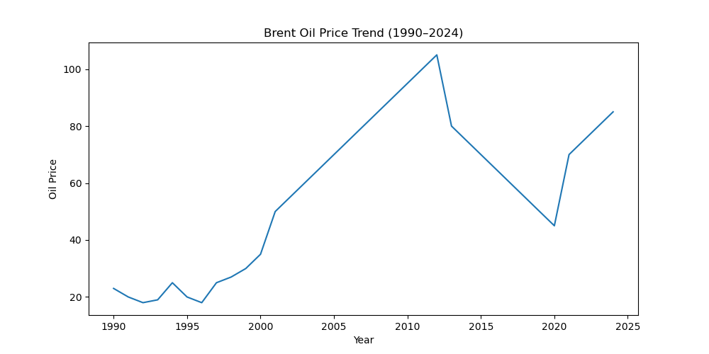
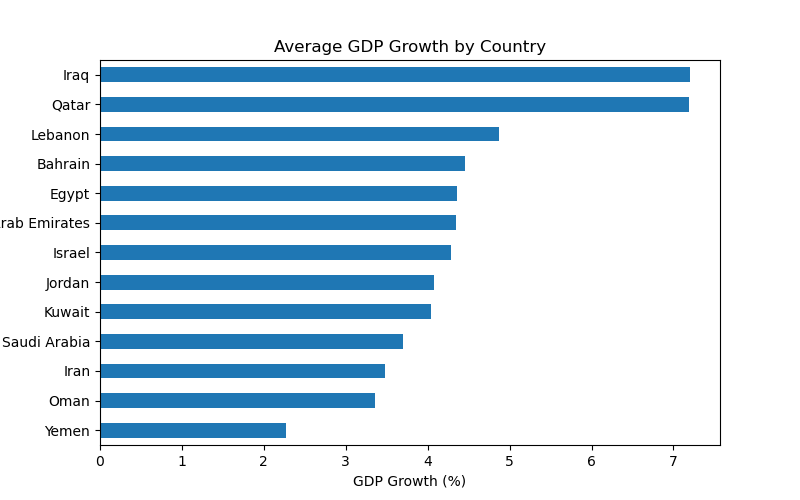
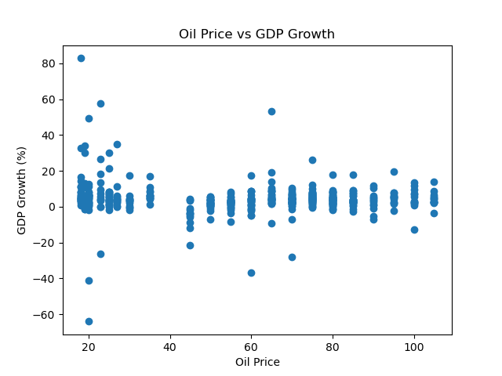
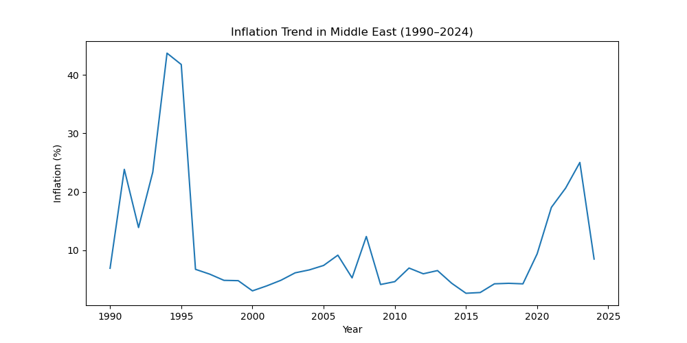
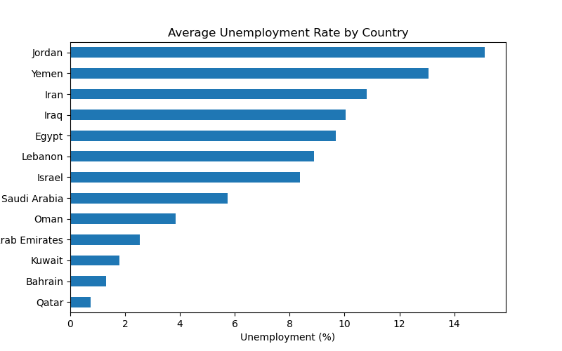

# Middle East Economic Analysis (1990–2024)

## Overview
This project analyzes economic indicators across Middle Eastern countries and explores the relationship between oil prices and economic growth.

## Tools Used
Python, Pandas, NumPy, Matplotlib, Seaborn

## Analysis
- GDP Growth by Country
- Oil Price Trend
- Oil Price vs GDP Growth
- Inflation Trend
- Unemployment Analysis

## Visualizations

## Oil Price Trend

## GDP Growth by Country

## Oil Price vs GDP Growth

## Inflation Trend

## Unemployment by Country

## Correlation Heatmap

